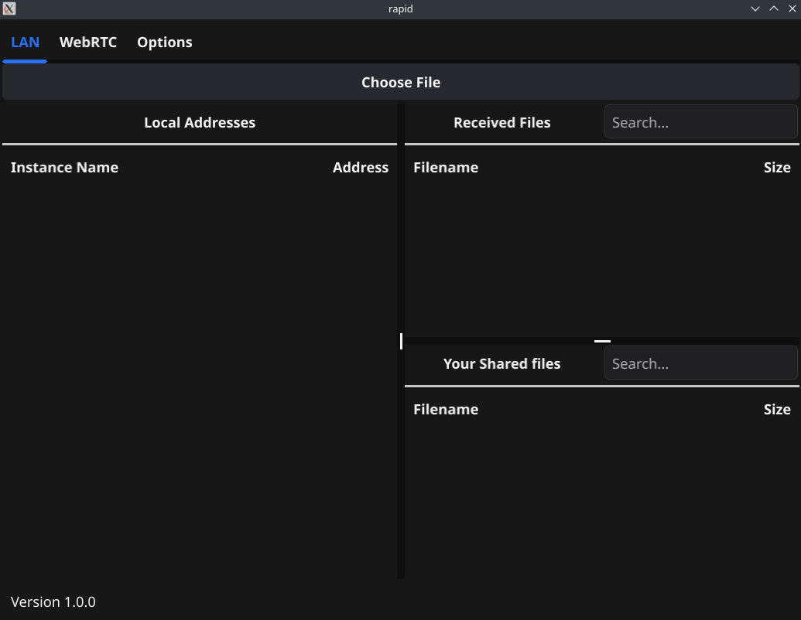

# rapid

**Rapid** is a desktop application for local network file sharing between devices, as well as file sharing via WebRTC P2P.

Just pet project =)

> **⚠️ Warning**  
> This is far from the final version. Only a small part of the work has been done.

## TODO

- [x] File sharing on the local network
- [ ] File sharing via WebRTC
- [x] Main window for LAN
- [ ] Main window for WebRTC
- [ ] Main window for options
- [ ] Save files to os downloads dir
- [ ] Add sorting by names or size
- [ ] Add custom themes
- [ ] Add **appropriate** `README.md`
- [ ] Add restart
- [ ] Global refactor

## LAN

It works as follows:

1. We launch our application. The application starts searching for available devices with the service name `_rapid._tcp`.
2. We can choose which files we want to distribute to other devices via the “Choose File” button.
3. The list of available devices is automatically updated by continuously scanning through `mDNS` and then pinging these devices.
4. When we click on a device in the list, we get in the “Received Files” list the files that the other device is sharing.
5. When you click on any of the files, we send a request to download that file.
6. Also available is a search for our giveaway files and our received files. The list is updated automatically as you type.

## Launch

Clone repository, then:

```sh
go run cmd/rapid/main.go
```

Or you can build it for Windows using `windows.sh` on linux:

```sh
sh windows.sh
```

Or build for linux:

```sh
sh linux.sh
```

## How it looks

**Main window looks like this:**


**Multiple apps launched:**


**Filter received files:**


## Technologies used

1. [net/http](https://pkg.go.dev/net/http)
2. [zeroconf](https://github.com/grandcat/zeroconf)
3. [fyne](https://fyne.io/)